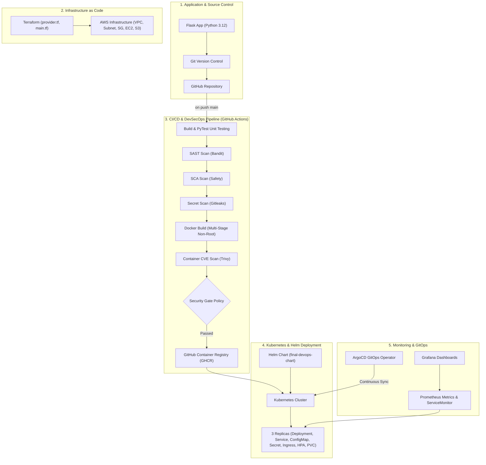

# Final DevOps End-to-End Project

**Student Name:** Shifa  
**Enrollment Number:** 24BCS10354  
**Email:** shifa.24bcs10354@sst.scaler.com  
**Repository:** [https://github.com/Ctrl-apk/devops-heros](https://github.com/Ctrl-apk/devops-heros)  

---

## 📌 1. Project Overview

This project is a comprehensive, production-grade **End-to-End DevOps & DevSecOps Platform** implementing modern Cloud-Native best practices. It bridges the full application lifecycle: from local Python microservice development to Terraform cloud infrastructure provisioning, Docker multi-stage container packaging, GitHub Actions automated CI/CD pipelines with integrated security scanning (SAST, SCA, Secrets, Container CVEs), Kubernetes deployment with Helm, Prometheus & Grafana monitoring, and GitOps continuous reconciliation via ArgoCD.

---

## 🏗️ 2. Architecture Diagram



---

## 🛠️ 3. Technologies Used

| Category | Technology / Tool | Purpose |
|---|---|---|
| **Application** | Python 3.12, Flask, Gunicorn, PyTest | Web API microservice & test suite |
| **Containerization** | Docker, Multi-stage Build, Alpine | Container packaging & optimization |
| **Infrastructure as Code** | Terraform, HCL, AWS Provider | Automated Cloud Infrastructure provisioning |
| **Orchestration** | Kubernetes, Minikube, kubectl | Container orchestration, HPA, Probes, Storage |
| **Package Management** | Helm 3 | Parameterized chart deployment & templating |
| **CI/CD** | GitHub Actions | Continuous Integration & Continuous Deployment workflows |
| **DevSecOps Security** | Bandit, Safety, Gitleaks, Trivy | SAST, SCA, Secret scanning, Container vulnerability checks |
| **Monitoring & Observability** | Prometheus, Grafana, ServiceMonitor | Metrics collection, alerts, dashboards, MELT pillars |
| **GitOps** | ArgoCD | Declarative GitOps deployment & continuous reconciliation |

---

## 📂 4. Project Directory Structure

```text
final-devops-project/
├── application/
│   ├── app.py
│   ├── requirements.txt
│   └── test_app.py
├── docker/
│   ├── Dockerfile
│   └── .dockerignore
├── kubernetes/
│   ├── deployment.yaml
│   ├── service.yaml
│   ├── configmap.yaml
│   ├── secret.yaml
│   ├── ingress.yaml
│   ├── hpa.yaml
│   └── pvc.yaml
├── helm/
│   ├── Chart.yaml
│   ├── values.yaml
│   └── templates/
│       ├── _helpers.tpl
│       ├── deployment.yaml
│       ├── service.yaml
│       ├── configmap.yaml
│       ├── secret.yaml
│       ├── ingress.yaml
│       └── hpa.yaml
├── terraform/
│   ├── provider.tf
│   ├── variables.tf
│   ├── main.tf
│   └── outputs.tf
├── .github/
│   └── workflows/
│       └── devsecops-cicd.yml
├── security/
│   ├── gitleaks.toml
│   └── security-policy.md
├── monitoring/
│   ├── prometheus-config.yaml
│   └── servicemonitor.yaml
├── gitops/
│   ├── argocd-application.yaml
│   └── gitops-workflow.md
├── troubleshooting/
│   ├── broken-deployment.yaml
│   ├── broken-service.yaml
│   └── troubleshooting-log.md
└── README.md
```

---

## 🚀 5. Application Setup

Run the Flask microservice locally for development:

```bash
cd final-devops-project/application
python -m venv venv
source venv/bin/activate   # On Windows: venv\Scripts\activate
pip install -r requirements.txt
python app.py
```

Run unit tests:
```bash
pytest test_app.py -v
```

---

## 🐳 6. Docker Setup

Build and run the non-root, multi-stage Docker container locally:

```bash
cd final-devops-project
docker build -t devops-app:1.0.0 -f docker/Dockerfile .
docker run -d -p 5000:5000 --name devops-container devops-app:1.0.0
curl http://localhost:5000/health
```

---

## ☸️ 7. Kubernetes Deployment

Deploy raw manifests to your Kubernetes cluster:

```bash
kubectl create namespace final-devops
kubectl apply -f kubernetes/configmap.yaml
kubectl apply -f kubernetes/secret.yaml
kubectl apply -f kubernetes/pvc.yaml
kubectl apply -f kubernetes/deployment.yaml
kubectl apply -f kubernetes/service.yaml
kubectl apply -f kubernetes/ingress.yaml
kubectl apply -f kubernetes/hpa.yaml
```

Verify deployment status:
```bash
kubectl get all -n final-devops
```

---

## ☸️ 8. Helm Deployment

Deploy using the parameterized Helm chart:

```bash
cd final-devops-project/helm
helm lint .
helm install devops-release . --namespace final-devops --create-namespace
helm status devops-release -n final-devops
```

Upgrade or Rollback:
```bash
helm upgrade devops-release . --set replicaCount=5 -n final-devops
helm history devops-release -n final-devops
helm rollback devops-release 1 -n final-devops
```

---

## ☁️ 9. Terraform Infrastructure

Provision AWS cloud infrastructure (VPC, Subnet, Security Group, EC2, S3):

```bash
cd final-devops-project/terraform
terraform init
terraform plan
terraform apply -auto-approve
```

Inspect Terraform outputs:
```bash
terraform output
```

Clean up infrastructure:
```bash
terraform destroy -auto-approve
```

---

## 🔒 10. DevSecOps & CI/CD Pipeline

The GitHub Actions workflow (`.github/workflows/devsecops-cicd.yml`) automates the security quality gates on every push:

1. **Build & Unit Testing:** PyTest suite validates API contracts.
2. **SAST (Bandit):** Scans Python code for injection risks and insecure configurations.
3. **SCA (Safety):** Verifies third-party dependency vulnerabilities in `requirements.txt`.
4. **Secret Scanning (Gitleaks):** Audits commits to prevent hardcoded passwords or API keys.
5. **Container Scanning (Trivy):** Scans built image layers for High/Critical CVEs.
6. **Security Gate Policy:** Halts execution if security standards fail.

---

## 📊 11. Monitoring & Observability

- **Metrics Scrape Target:** Configured via `monitoring/servicemonitor.yaml` scraping `/metrics` on port 80.
- **Prometheus Rules:** Tracks CPU usage, Memory limits, HTTP request throughput, and latency histograms.
- **Grafana Dashboard:** Visualizes application pod health, scaling thresholds, and node load.

---

## 🔄 12. GitOps with ArgoCD

ArgoCD continuously reconciles cluster state against the Git repository:

```bash
kubectl apply -f gitops/argocd-application.yaml
```

- **Automated Sync:** Changes merged to `main` branch immediately sync to cluster.
- **Self-Healing:** Out-of-band manual changes (`kubectl edit`) are automatically reverted to match Git state.

---

## 🛠️ 13. Final Troubleshooting Challenge

Detailed in [`troubleshooting/troubleshooting-log.md`](./troubleshooting/troubleshooting-log.md):

| Issue | Identified Failure | Root Cause | Fixed Applied | Verification |
|---|---|---|---|---|
| 1 | `ImagePullBackOff` | Nonexistent image tag `nonexistent-tag-9999` | Corrected image tag to `1.0.0` in `deployment.yaml` | Pod status changed to `Running` |
| 2 | `CrashLoopBackOff` | Liveness probe querying port `9090` instead of `5000` | Aligned liveness probe port to `5000` | Health check returns 200 OK |
| 3 | Empty Endpoints (`<none>`) | Selector mismatch (`wrong-label-selector-name`) | Updated Service selector to `app: devops-app` | Endpoints populated with Pod IPs |

---

## 📸 14. Screenshots & Evidence

- **Docker Multi-Stage Build & Running Container:** `session6-7-docker/multi-stage-dockerfile/screenshots/ouput.png`
- **Kubernetes Pods & Services:** `session-11-kubernetes-services/screenshots/clusterip.png`
- **Helm Release History:** `homework/14-helm/README.md`
- **DevSecOps Pipeline Execution:** `homework/16-devsecops/README.md`
- **Terraform Plan & Apply:** `homework/18-cloud-terraform/README.md`

---

## 💡 15. Lessons Learned

1. **Shift Security Left:** Integrating SAST, SCA, and Trivy container scanning into CI prevents vulnerable container images from reaching Kubernetes clusters.
2. **Ephemeral vs Persistent Storage:** Decoupling application logic from state using PVCs and StorageClasses ensures database durability during pod restarts.
3. **Declarative GitOps:** Tools like ArgoCD eliminate configuration drift and guarantee that Git remains the single source of truth for all production environments.
4. **Resilient Health Probes:** Configuring appropriate initial delays and readiness thresholds prevents premature container restarts during app startup.
