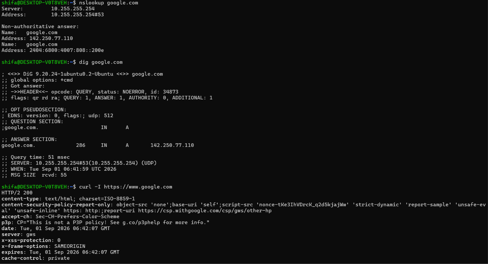
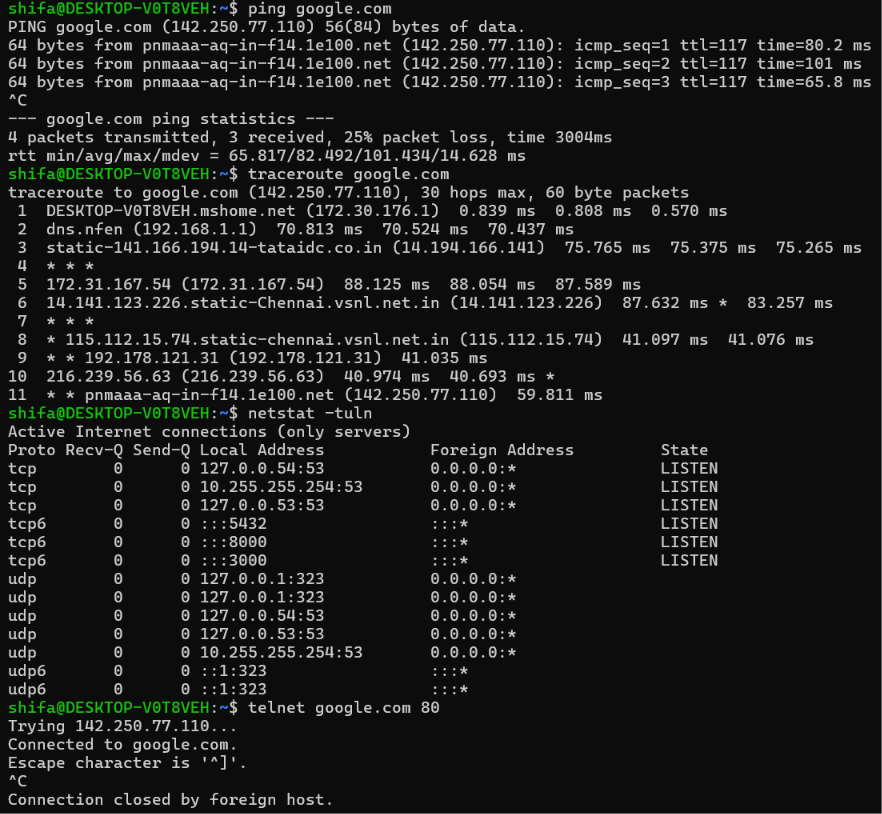

# 03 — Networking

**Name:** Shifa | **Enrollment:** 24BCS10354 | **Email:** shifa.24bcs10354@sst.scaler.com

> Full files: [../../session4-networking/](../../session4-networking/)

---

## Commands Practiced

### 1. `ping`

```bash
ping google.com
```

Checks whether a host is reachable. Sends ICMP packets and measures round-trip time. Useful for testing basic connectivity and latency.

---

### 2. `traceroute`

```bash
traceroute google.com
```

Shows every network hop between your machine and the destination. Each hop is a router the packet passes through. Useful for identifying where delays or failures occur.

---

### 3. `netstat`

```bash
netstat -tulnp
```

Displays active network connections, listening ports, and which process owns each. The flags mean: `-t` TCP, `-u` UDP, `-l` listening, `-n` numeric, `-p` process.

---

### 4. `ss`

```bash
ss -tulnp
```

Modern replacement for `netstat`. Faster and more detailed. Same flags apply.

---

### 5. `telnet`

```bash
telnet google.com 80
```

Tests whether a TCP connection can be established to a specific host and port. Useful for checking if a service is reachable.

---

### 6. `tcpdump`

```bash
sudo tcpdump -i eth0
```

Captures and displays packets on a network interface in real time. Useful for deep network debugging and traffic analysis.

---

### 7. `nslookup`

```bash
nslookup google.com
```

Queries DNS to resolve a domain name to an IP address. Useful for troubleshooting DNS issues.

---

### 8. `dig`

```bash
dig google.com
```

Performs detailed DNS queries. Shows the full DNS response including TTL, record type, and nameservers. More powerful than `nslookup`.

---

### 9. `curl`

```bash
curl -I https://google.com
```

Sends HTTP requests and shows the response. `-I` shows only the response headers. Useful for testing web server connectivity and responses.

---

### 10. `ip`

```bash
ip a          # Show all network interfaces and IPs
ip route      # Show routing table
```

Modern replacement for `ifconfig`. Shows IP addresses, network interfaces, and routing information.

---

## Screenshots




---

## Resources

- [DevOps-Hero Networking Resources](../../session4-networking/resources.md)
- [Linux Networking Cheat Sheet](../../session2-linux/Linux%20Networking%20Cheat%20Sheet.pdf)
