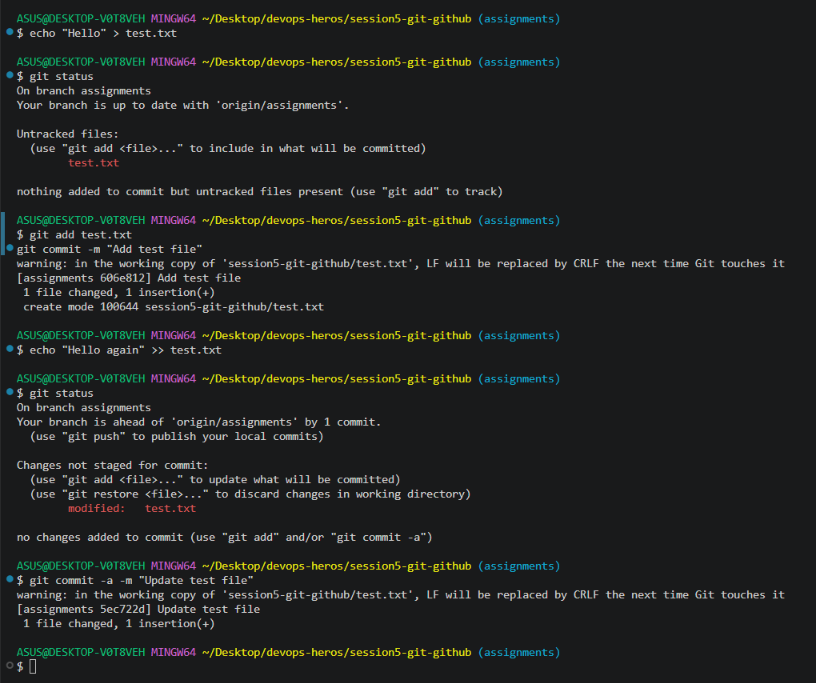
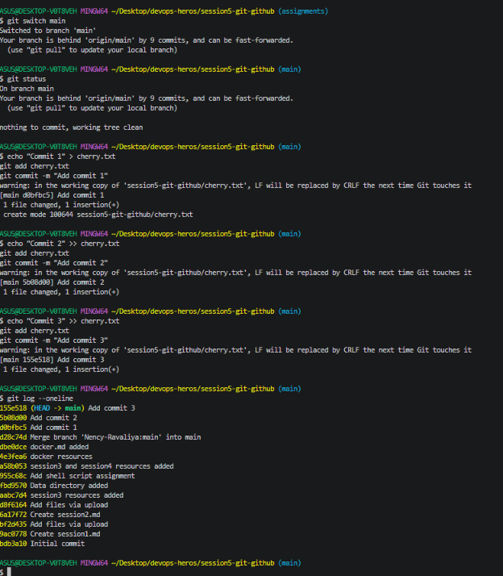
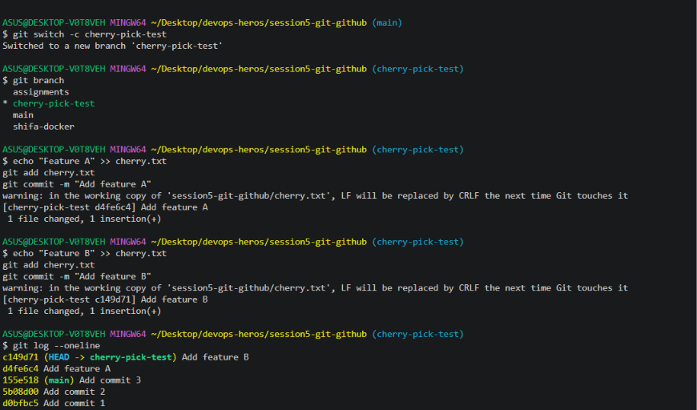
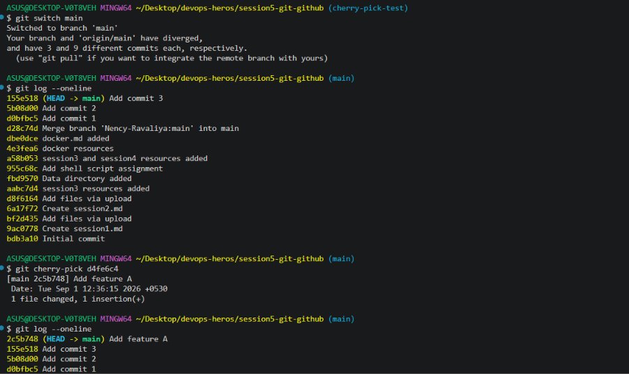

# 04 — Git and GitHub

**Name:** Shifa | **Enrollment:** 24BCS10354 | **Email:** shifa.24bcs10354@sst.scaler.com

> Full files: [../../session5-git-github/](../../session5-git-github/)

---

## Task 1: `git commit -m` vs `git commit -a -m`

| Command | Behavior |
|---|---|
| `git commit -m "message"` | Commits only files already staged with `git add` |
| `git commit -a -m "message"` | Auto-stages all **modified/deleted tracked files** then commits |

> `git commit -a -m` does **not** include newly created untracked files — those still need `git add` first.

### Commands

```bash
# Standard commit — requires git add first
git add file.txt
git commit -m "Add file"

# Auto-stage modified tracked files and commit
git commit -a -m "Update file"
```

### Screenshot



---

## Task 2: Git Cherry-Pick

`git cherry-pick` applies a specific commit from one branch onto another — without merging the entire branch. Useful for pulling in a single fix or feature.

### Walkthrough

```bash
# Step 1: Create commits in main
git commit -m "Commit 1"
git commit -m "Commit 2"
git commit -m "Commit 3"

# Step 2: View commit log
git log --oneline

# Step 3: Create new branch and add commits
git checkout -b new-branch
git commit -m "Feature A"
git commit -m "Feature B"
git commit -m "Feature C"

# Step 4: View log to find target commit hash
git log --oneline

# Step 5: Switch back to main and cherry-pick one commit
git checkout main
git cherry-pick <commit-hash>

# Step 6: Verify it's in main
git log --oneline
```

### Screenshots







---

## Resources

- [Git Documentation](https://git-scm.com/docs)
