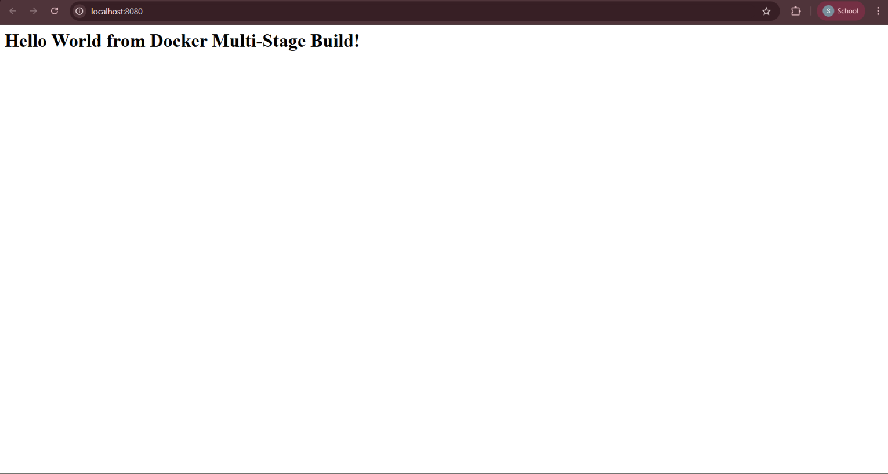

# 06 — Dockerfiles & Images (Multi-Stage Build)

**Name:** Shifa | **Enrollment:** 24BCS10354 | **Email:** shifa.24bcs10354@sst.scaler.com

> Full code: [../../session6-7-docker/multi-stage-dockerfile/](../../session6-7-docker/multi-stage-dockerfile/)

---

## Task: Multi-Stage Dockerfile

### What is Multi-Stage Build?

A multi-stage build uses multiple `FROM` statements in one Dockerfile. Each stage can copy artifacts from the previous one. The final image only contains what's needed to run the app — not the build tools — resulting in a much smaller image.

### Dockerfile

```dockerfile
# Stage 1: Build
FROM node:24-alpine AS builder
WORKDIR /app
COPY package*.json ./
RUN npm install
COPY . .

# Stage 2: Production
FROM node:24-alpine AS production
WORKDIR /app
COPY --from=builder /app/package*.json ./
RUN npm install --omit=dev
COPY --from=builder /app/server.js ./
EXPOSE 8080
CMD ["npm", "start"]
```

---

## Commands

```bash
# Build
docker build -t multi-stage-app ../../session6-7-docker/multi-stage-dockerfile

# Run
docker run -d -p 8080:8080 --name multi-stage-app multi-stage-app

# Verify
docker ps
```

Open `http://localhost:8080` → **Hello World from Docker Multi-Stage Build!**

---

## Application Output



## docker ps Output


---

## Deployed Applications (3 types)

| App | Port | Command |
|---|---|---|
| Node.js | 3000 | `docker run -d -p 3000:3000 nodejs-hello` |
| Python | 5000 | `docker run -d -p 5000:5000 python-hello` |
| Java | 8080 | `docker run -d -p 8080:8080 java-hello` |

---

## Resources

- [Docker Multi-Stage Builds](https://docs.docker.com/build/building/multi-stage/)
