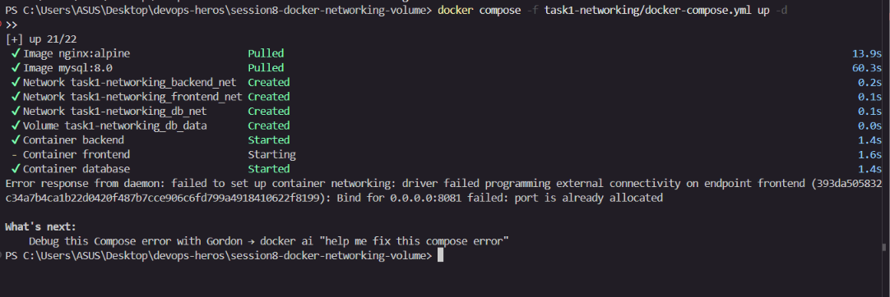
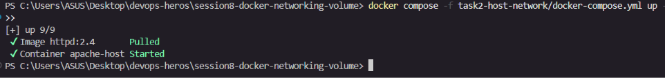
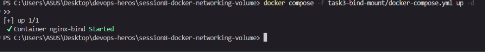
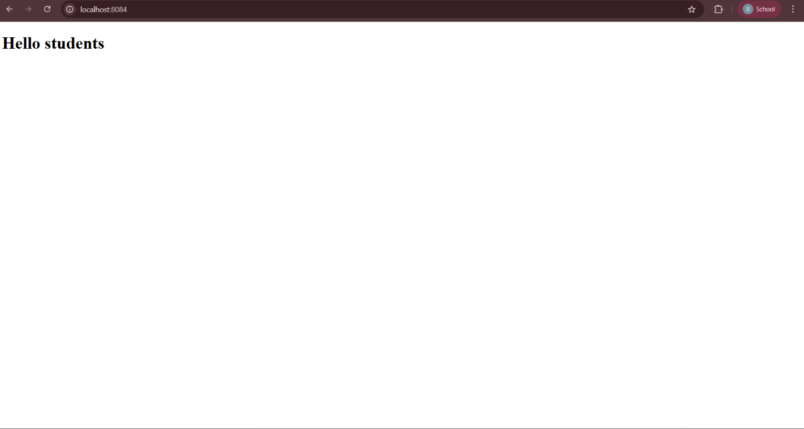

# 07 — Docker Networking & Volumes

**Name:** Shifa | **Enrollment:** 24BCS10354 | **Email:** shifa.24bcs10354@sst.scaler.com

> Full code: [../../session8-docker-networking-volume/](../../session8-docker-networking-volume/)

---

## Task 1: Container Networking (3 containers, 3 networks)

3 containers across 3 bridge networks. Backend is on 2 networks so it can talk to both frontend and database. Frontend cannot reach database directly.

```
frontend ──── frontend_net ──── backend
                                   │
                              backend_net
                                   │
database ──────── db_net ──────────
```

```bash
cd ../../session8-docker-networking-volume/task1-networking
docker compose up -d
docker ps
docker network ls
docker exec -it backend ping frontend   # works
docker exec -it backend ping database   # works
docker exec -it frontend ping database  # fails — different network
docker compose down
```

### Screenshot



---

## Task 2: Host Network (Apache)

Apache container shares the host's network stack directly — no port mapping needed.

```bash
cd ../../session8-docker-networking-volume/task2-host-network
docker compose up -d
docker inspect apache-host --format '{{.HostConfig.NetworkMode}}'
# Open http://localhost:80
docker compose down
```

### Screenshot



---

## Task 3: Bind Mount

Local `index.html` is mounted into an Nginx container. Editing the file locally reflects instantly in the browser without restarting the container.

```bash
cd ../../session8-docker-networking-volume/task3-bind-mount
docker compose up -d
# Open http://localhost:8084 — shows "Hello students"
# Edit index.html, refresh browser — change appears instantly
docker compose down
```

### Screenshot



---

## Task 4: Overlay Network

Overlay networks allow containers on **different Docker hosts** to communicate as if on the same network. Requires Docker Swarm.

```bash
docker swarm init
docker network create -d overlay my-overlay
docker service create --name web --network my-overlay nginx
docker network ls
docker network inspect my-overlay
```

| Feature | Detail |
|---|---|
| Driver | `overlay` |
| Requires | Docker Swarm mode |
| Protocol | VXLAN tunneling |
| Scope | Multi-host |
| vs Bridge | Bridge = single host, Overlay = multi-host |

### Screenshot



---

## Resources

- [Docker Networking Docs](https://docs.docker.com/engine/network/drivers/)
- [Docker Overlay Networks](https://docs.docker.com/engine/network/drivers/overlay/)
- [Docker Bind Mounts](https://docs.docker.com/engine/storage/bind-mounts/)
