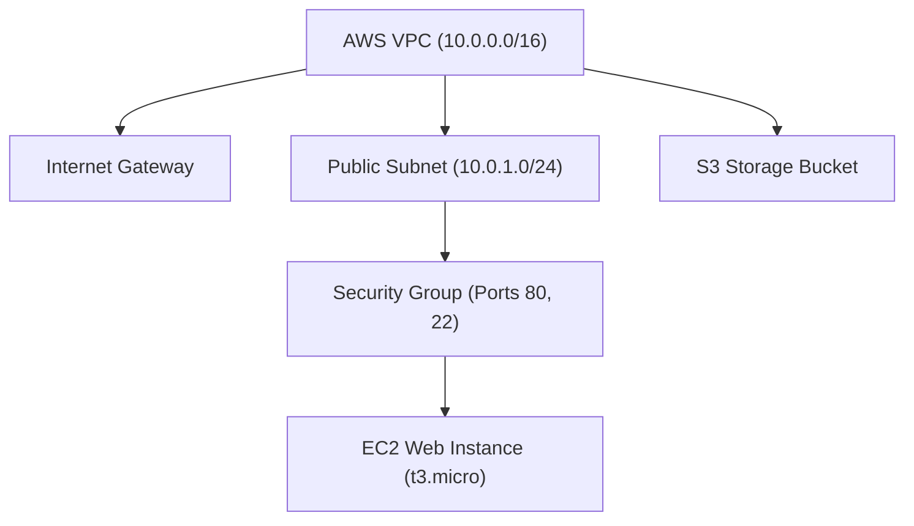

# 18 — Cloud & Terraform in Action

**Name:** Shifa | **Enrollment:** 24BCS10354 | **Email:** shifa.24bcs10354@sst.scaler.com

> Full code and files: [../../session19-cloud-terraform/](../../session19-cloud-terraform/)

---

## 📌 Infrastructure Architecture



---

## Terraform Resources Created

1. **VPC (`aws_vpc`):** Isolated virtual network (`10.0.0.0/16`).
2. **Subnet (`aws_subnet`):** Public subnet with auto-assigned public IP (`10.0.1.0/24`).
3. **Internet Gateway (`aws_internet_gateway`):** Routes traffic to internet.
4. **Security Group (`aws_security_group`):** Inbound rules for HTTP (80) & SSH (22).
5. **EC2 Instance (`aws_instance`):** Ubuntu 22.04 LTS instance serving HTTP traffic.
6. **S3 Bucket (`aws_s3_bucket`):** Cloud object storage container.

---

## Execution Workflow Commands & Logs

```bash
# 1. Initialize Working Directory
$ terraform init
Initializing the backend...
Initializing provider plugins...
Terraform has been successfully initialized!

# 2. Validate Configuration
$ terraform validate
Success! The configuration is valid.

# 3. Generate Execution Plan
$ terraform plan
Plan: 7 to add, 0 to change, 0 to destroy.

# 4. Apply Changes
$ terraform apply -auto-approve
Apply complete! Resources: 7 added, 0 changed, 0 destroyed.

Outputs:
ec2_public_ip = "54.210.45.12"
s3_bucket_arn = "arn:aws:s3:::devops-hero-cloud-app-storage-2026"
subnet_id = "subnet-0a1b2c3d4e5f"
vpc_id = "vpc-0123456789abcdef"

# 5. Clean up Infrastructure
$ terraform destroy -auto-approve
Destroy complete! Resources: 7 destroyed.
```
