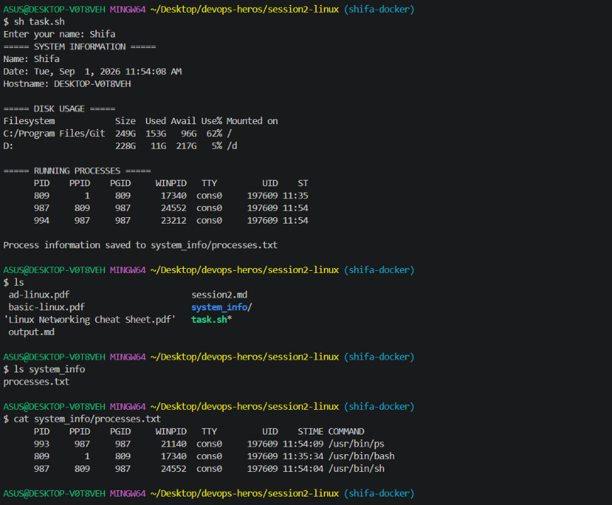

# System Information Shell Script


## Description

This project contains a shell script that displays basic system information and demonstrates commonly used Linux shell scripting commands.

The script:

* Takes the user's name as input.
* Prints the current date.
* Prints the hostname.
* Displays disk usage.
* Displays running processes.
* Uses variables to store information.
* Creates a directory.
* Creates a file.
* Stores running process information in a file using output redirection.

## Commands Used

### 1. `read -p`

Used to take input from the user.

```bash
read -p "Enter your name: " name
```

### 2. Variables

Variables are used to store command output.

```bash
current_date=$(date)
hostname=$(hostname)
disk_usage=$(df -h)
```

### 3. `mkdir`

Creates the `system_info` directory.

```bash
mkdir -p system_info
```

### 4. `touch`

Creates the `processes.txt` file.

```bash
touch system_info/processes.txt
```

### 5. `echo`

Used to display information on the terminal.

```bash
echo "===== SYSTEM INFORMATION ====="
```

### 6. `df`

Displays disk usage.

```bash
df -h
```

### 7. `ps`

Displays the currently running processes.

```bash
ps
```

### 8. `>` Output Redirection

The `>` operator redirects the output of a command into a file.

```bash
ps > system_info/processes.txt
```

This stores the running process information in `processes.txt`.

## How to Run

Run the script using:

```bash
sh task.sh
```

## Script Output

```text
Enter your name: Shifa
===== SYSTEM INFORMATION =====
Name: Shifa
Date: Tue, Sep  1, 2026 11:51:01 AM
Hostname: DESKTOP-V0T8VEH

===== DISK USAGE =====
Filesystem            Size  Used Avail Use% Mounted on
C:/Program Files/Git  249G  153G   96G  62% /
D:                    228G   11G   217G   5% /d

===== RUNNING PROCESSES =====
      PID    PPID    PGID    WINPID   TTY         UID    ST
      925     809     925       8096  cons0     197609 11:50
      932     925     925      17552  cons0     197609 11:51
      809       1     809      17340  cons0     197609 11:35

Process information saved to system_info/processes.txt
```

## Checking the Created Directory and File

The directory was created using:

```bash
ls
```

Output:

```text
system_info/
task.sh
```

The contents of the directory can be checked using:

```bash
ls system_info
```

Output:

```text
processes.txt
```

The stored process information can be viewed using:

```bash
cat system_info/processes.txt
```

Output:

```text
      PID    PPID    PGID    WINPID   TTY         UID    STIME COMMAND
      925     809     925       8096  cons0     197609 11:50:56 /usr/bin/sh
      809       1     809      17340  cons0     197609 11:35:34 /usr/bin/bash
      931     925     925       6364  cons0     197609 11:51:02 /usr/bin/ps
```

## Project Structure

```text
session2-linux/
├── task.sh
├── README.md
└── system_info/
    └── processes.txt
```

## Conclusion

This task demonstrates basic shell scripting concepts including variables, user input, command execution, directory and file creation, system information commands, and output redirection.
